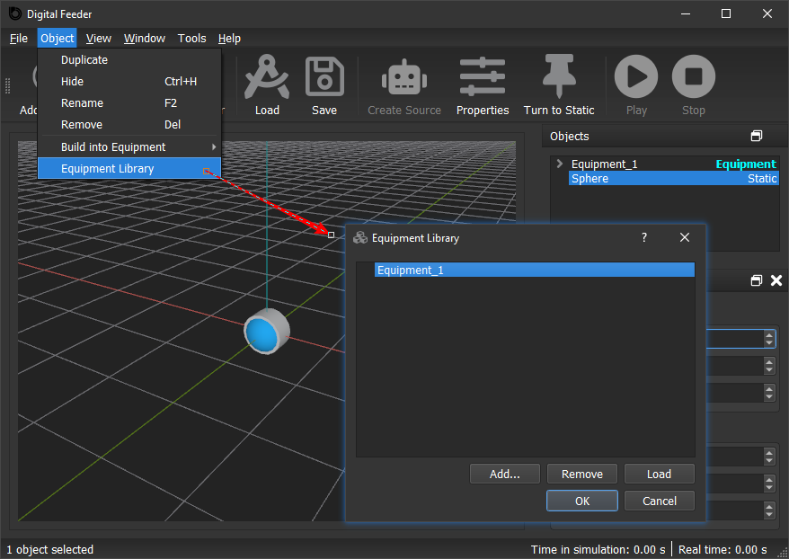
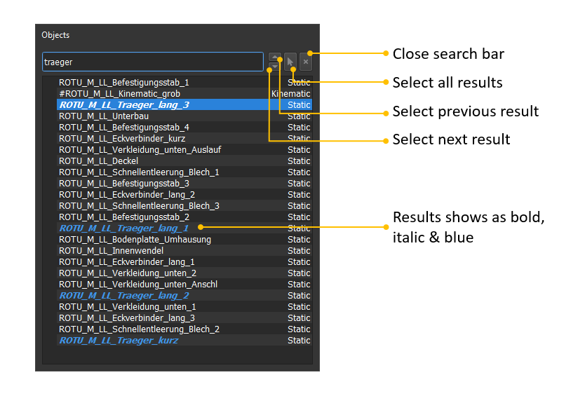

## ✨ Digital Feeder 1.4.1  &nbsp;[<i class="fas fa-download fa-xs"></i>](https://github.com/RNADigitalSolutions/Digital_Feeder_Release/raw/main/Digital_Feeder_1.4.1.zip)
<i class="far fa-calendar-alt"></i> &nbsp; 23.06.2021

### Major changes
- This version of Digital Feeder has been upgraded to a multithreading structure with many backend improvements. Multithreading gives Digital Feeder more possibilities for further development of many other new features in the future, such as animation pausing/replaying, GUI switching (GUIs built with modern technologies), simulation speed optimisation, upgrade to web app etc..
- Better object structure, which makes the further development easier, such as adding new kinematic motion types, e.g. impuls.

### Improvements
- Initial margin of a custom object can be read now
- Waiting-popups while loading and saving `.dfs` files
- The position and angle of an object are displayed in the manipulator in real time during simulation 
- Better memory management: Simulation and rendering consume less memory.
- Setting tab for vibration rearranged.

## ✨ Digital Feeder 1.3.6  &nbsp;[<i class="fas fa-download fa-xs"></i>](https://github.com/RNADigitalSolutions/Digital_Feeder_Release/raw/main/Digital_Feeder_1.3.6.zip)
<i class="far fa-calendar-alt"></i> &nbsp; 11.04.2021

### New feature
- Factor value for default kinematic parameters.

## ✨ Digital Feeder 1.3.5  &nbsp;[<i class="fas fa-download fa-xs"></i>](https://github.com/RNADigitalSolutions/Digital_Feeder_Release/raw/main/Digital_Feeder_1.3.5.zip)
<i class="far fa-calendar-alt"></i> &nbsp; 06.04.2021

### New feature
- License system.

## ✨ Digital Feeder 1.3.4  &nbsp;[<i class="fas fa-download fa-xs"></i>](https://github.com/RNADigitalSolutions/Digital_Feeder/releases/download/v1.3.4/Digital_Feeder_1.3.4.zip)
<i class="far fa-calendar-alt"></i> &nbsp; 25.03.2021

### New features
- BSA support for cylinder and sphere.

## ✨ Digital Feeder 1.3.3  &nbsp;[<i class="fas fa-download fa-xs"></i>](https://github.com/RNADigitalSolutions/Digital_Feeder/releases/download/v1.3.3/Digital_Feeder_1.3.3.zip)
<i class="far fa-calendar-alt"></i> &nbsp; 24.03.2021

### New features
- Save/load BSA json file

### Bug fix
- Moved origin of coordinate system from center of bounding box to center of mass of the object

## ✨ Digital Feeder 1.3.2  &nbsp;[<i class="fas fa-download fa-xs"></i>](https://github.com/RNADigitalSolutions/Digital_Feeder/releases/download/v1.3.2/Digital_Feeder_1.3.2.zip)
<i class="far fa-calendar-alt"></i> &nbsp; 24.03.2021

### New features
- Show/hide original collision shape in simplification dialog

## ✨ Digital Feeder 1.3.1  &nbsp;[<i class="fas fa-download fa-xs"></i>](https://github.com/RNADigitalSolutions/Digital_Feeder/releases/download/v1.3.1/Digital_Feeder_1.3.1.zip)
<i class="far fa-calendar-alt"></i> &nbsp; 23.03.2021

### Bug fix
- Calculate the vibration with kinematic parameters as second rotation (using quaternion multiplication), instead of as the superposition of the first rotation (addition).

## ✨ Digital Feeder 1.3.0  &nbsp;[<i class="fas fa-download fa-xs"></i>](https://github.com/RNADigitalSolutions/Digital_Feeder/releases/download/v1.3.0/Digital_Feeder_1.3.0.zip)
<i class="far fa-calendar-alt"></i> &nbsp; 26.02.2021

### New features
- New simplification type: **basic shape assembly**.
- Add **default material** menu into *Physical Properties* dialog window.
- Add **default kinematic** menu into *Physical Properties* dialog window.
- **Reset** button to remove everything from the scenario.

### Improvements
- Zoom in&out with scroll wheel without moving the camera focus point.
- Update Bullet engine to 3.08
- Simplification preview improved.

## ✨ Digital Feeder 1.2.4  &nbsp;[<i class="fas fa-download fa-xs"></i>](https://github.com/RNADigitalSolutions/Digital_Feeder/releases/download/v1.2.4/Digital_Feeder_1.2.4.zip)
<i class="far fa-calendar-alt"></i> &nbsp; 24.01.2021

### Bug fixes

- Kinematic does not go back to neutral location after simulation stops.
- Object states cannot be reset properly after simulatin stops.
- Limit of duplicated source cannot be copied.

## ✨ Digital Feeder 1.2.3
<i class="far fa-calendar-alt"></i> &nbsp; 20.01.2021

### Bug fixes

- Position is unproperly set after stop and restart

## ✨ Digital Feeder 1.2.2
<i class="far fa-calendar-alt"></i> &nbsp; 20.01.2021

### Bug fixes

- Time is not reset once stopped.
- Generated part count of source is not reset once stopped, which may cause source stop generating parts after restarted.
- `dfs` file with object with modified margin value cannot be loaded.
- About window may cause crash.

## ✨ Digital Feeder 1.2.1
<i class="far fa-calendar-alt"></i> &nbsp; 11.01.2021

### Improvements

- Maximize window after start.
- New icons.
- Equipment button on tool bar.
- Bigger default width of object list.

### Bug fixes

- Neutral point of vibration is shiftet after pausing simulation.

## ✨ Digital Feeder 1.2.0 
<i class="far fa-calendar-alt"></i> &nbsp; 25.12.2020 Merry Christmas

### New features

- Simplification: bounding box, cylinder & sphere.
	- Auto-selection of the most suitable bounding shape when simplifing the custom object.
- Inclined vibration: when an object is not rotated or rotated only around one axis, it can be set with an inclined vibration: it's only necessary to input the amplitude in the inclinde direction, the direction along the axises with be automatically calculated. (If it's not rotated, the vibration is set along the z axis.)
- Setting to automatically remove objects that are vertically positioned below a specific point during the simulation.

### Improvements

- Shared collsion shape data:
	1. saves CPU. the collsion shape data is calculated ONCE when a custom object is loaded from stl file. The data will not be recalculated again when this custom obj is cloned.
	2. saves RAM. collision shape data is saved only ONCE in RAM for all custom objects from the same source stl file.
- Values in settings dialog are saved in Windows Registry. 
- Reset settings to default values.
- Remove the unfinished material settings from object properties dialog.

### Bug fixes

- Corrected Upper limit of generated objects shown in source properties dialog from 99 to 999999999.

## ✨ Digital Feeder 1.1.0 
<i class="far fa-calendar-alt"></i> &nbsp; 07.12.2020

### **Attention**

Due to the new **Equipment** feature, **Stop** button does not work properly again, it's always a headache. Therefore it's **temporarily** disabled in this version.

### New features

- **Equipment**: **Static** und **kinematic** objects can be now added into a new/existing equipment.

- **Equipment library**: An equipment in the current scenario can be added into the equipment library. The equipments in the library can be loaded into the current scenario.

### Known issues

- Equipments in **equipment library** with the SAME NAME can cause chaos. So it's recommanded to rename an equipment before adding it into library.
- One equipment can only be added into the library ONCE.
- Equipment cannot be rotated.

### Features in todo

- Solve above issues.
- Preview in Equipment Library window.
- Rename equipment in Equipment Library.
- Drag a component out of the equipment, which it belongs.

### Improvements

- Replaced GPL-licensed library `tarlib` with BSD-licensed library `libarchive`, which is also more powerful and stable.
- Removed GPL-licensed library `qcustomplot` and its related feature **Plot Motion**.

## ✨ Digital Feeder 1.0.4
<i class="far fa-calendar-alt"></i> &nbsp; 23.10.2020

### New features

- Margin setting.
- Higher simulation step precision (it can be set to 0.1 ms now).

### Improvements

- Expanded the range of vibration values to 999 mm.
- Added License information.

### Bug fixes
- Visibility status was not saved into scenario file.
- When a scenraio file is loaded serveral times, objects and sources share the same id.

## ✨ Digital Feeder 1.0.0
<i class="far fa-calendar-alt"></i> &nbsp; 22.09.2020

### **Attention**

Due to the new **transformation** function, this version may have problems loading the `dfs` file generated by the previous versions. Therefore, you may need to use this version to recreate a `dfs` file for a corresponding scene.

### New features

- **Search bar**: search objects and sources by name (shortcut <kbd>Ctrl</kbd>+<kbd>F</kbd>).

- Transformation: when importing an `stl` file, user can choose to import it as a tooling or feeding part:
	- As tooling: the object can only be set to static or kinemaic,
	- As feeding part: origin of the coordinate system of the object will be moved to the center of mass.
- Source Properties: source can be parameterized now.
- Remove source, at the same time all child objects of the source will be removed as well.
- Move and rotate source from manipulator.

### Improvements

- Highlight selected source.
- Save button on tool bar.
- By source generated objects are named with number.
- Source is shown as bold and yellow in tree view, to make it more obvious.

## ✨ 02.09.2020 (incomplete version)

### New features

- 3D-window picker: selection of objects and sources from 3D-window (holding <kbd>Ctrl</kbd> or <kbd>Shift</kbd> for multiselection).
- Tree view: the objects generated from one source will be shown in a group.
- Content menu for selected objects and/or sources from tree view and 3D-window.
- **Source Properties** Dialog: the paramters of source can be shown here, and source can be also paused and restarted.
- Normal distribution for restitution and friction.
- Hide/unhide objects and sources.

### Improvements

- Adjusted icon for **Create Source** button.
- Better structure of the entire codebase.

### Incomplete features

This version is incomplete. The following features are still under heavy construction and will be done in next releases:

- **Stop** button: it does not work properly (again).
- Source is still not parameterizable from **Source Properties**.
- Source cannot be removed.
- Selected source still cannot be highlighted in 3D-window.
- By clicking on **Properties** button: 
	- when only objects are selected, the **Object Properties** dialog shows;
	- when only sources are selected, the **Source Properties** dialog shows;
	- But when both objects and sources are selected, also only the **Object Properties** dialog shows, which is wrong. (In the next release, a dialog will be shown at first, to let user choose which dialog window to be shown.)

## ✨ 19.07.2020

###  Improvements

- Greater camera far plane to render the objects far away from camera.

### Bug fixes

- Failure when setting color of sevaral objects parallelly.
- Failure when turning object from static to kinematic.

## ✨ 07.07.2020

### New features

- Set static object **immaterial**, in oder to remove its rigid body from simulation.
- New file format `.dfs` (*Digital Feeder Scenario*).
- Drag & Drop `.stl` and `.dfs` files.
- Open `.dfs` file directly with Digital Feeder.
- Multi parameterization.

### Bug fixes

- Crash when loading ASCII `stl` file.

## ✨ 16.06.2020

### New features:

- Shortcut: double click middle button on object: Move camera to current selected object and set it as the camera focus center.
- Motion flag (Dynamic/Static/Kinematic) for each object shown in object list.
- Stop simulation: before the first run of the simulation, the scenario will be saved as the start scenario. When clicking the stop button, the scenario will be reset to the start scenario:

 

###  Improvements

- Import several `stl`-files at the same time. The selection count is shown in status bar.
- Rename the imported `stl` objects with their file name automatically.
- Object multiselection und deselection.
- Optimized the behavior of button state switching (enabled/disabled).
- After simulation paused/stopped, the object position and angle will be updated in the manipulator.
- Warning when create more than one source at the same time.
- The objects, which are cloned from the same part source, share the same bullet collision shape.

### Bug fixes

- Manipulator behavior.
- Stop button behavior.

<head>
  <link rel="stylesheet" href="https://use.fontawesome.com/releases/v5.15.2/css/all.css">
</head>